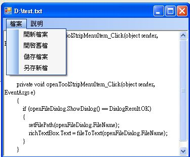

# C# 視窗程式：設計文字編輯器

教學錄影：

* C# 檔案處理 -- <http://youtu.be/3EyPcAddd70>
* C# 文字編輯器 1 -- <http://youtu.be/xymT54El53E>
* C# 文字編輯器 2 -- <http://youtu.be/xz5sKvZjLZI>

專案下載：

* 只有介面的版本 (英文) -- <https://dl.dropbox.com/u/101584453/cs/code/Editor1.zip>
* 只有介面的版本 (中文) -- <https://dl.dropbox.com/u/101584453/cs/code/Editor2.zip>
* 完整版 -- <https://dl.dropbox.com/u/101584453/cs/code/TextEditor2012.zip>

執行結果




程式碼

```CS
using System;
using System.ComponentModel;
using System.Windows.Forms;
using System.IO;
namespace WindowsFormsApplication1
{
    public partial class FormEditor : Form
    {
        String filePath = null;

        public FormEditor()
        {
            InitializeComponent();
        }

        public static String fileToText(String filePath)
        {
            StreamReader file = new StreamReader(filePath);
            String text = file.ReadToEnd();
            file.Close();
            return text;
        }

        public static void textToFile(String filePath, String text)
        {
            StreamWriter file = new StreamWriter(filePath);
            file.Write(text);
            file.Close();
        }

        private void openFileToolStripMenuItem_Click(object sender, EventArgs e)
        {
            if (openFileDialog.ShowDialog() == DialogResult.OK)
            {
                String text = fileToText(openFileDialog.FileName);
                richTextBox.Text = text;
                filePath = openFileDialog.FileName;
            }
        }

        private void newFileToolStripMenuItem_Click(object sender, EventArgs e)
        {
            richTextBox.Text = "";
            filePath = null;
        }

        private void saveFileToolStripMenuItem_Click(object sender, EventArgs e)
        {
            if (filePath == null)
            {
                dialogSaveFile();
            }
            else
            {
                textToFile(filePath, richTextBox.Text);
            }
        }

        private void saveAsToolStripMenuItem_Click(object sender, EventArgs e)
        {
            dialogSaveFile();
        }

        public void dialogSaveFile()
        {
            if (saveFileDialog.ShowDialog() == DialogResult.OK)
            {
                textToFile(saveFileDialog.FileName, richTextBox.Text);
                filePath = saveFileDialog.FileName;
            }
        }

    }
}
```

