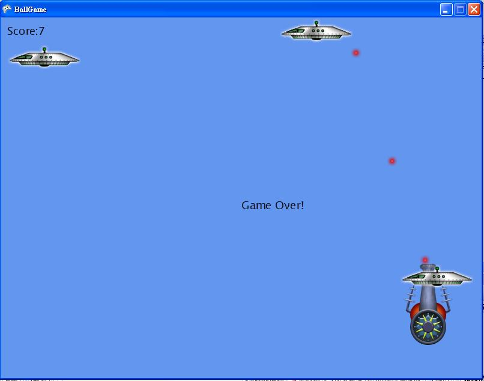

# C# 遊戲程式：XNA 遊戲引擎

## XNA 遊戲程式架構

XNA 是微軟於 2007 年推出的遊戲設計引擎，以 C# 為主要語言。因此，您可以輕易的用 C# 在 Visual Studio 的 XNA 開發工具中撰寫 2D、3D 電腦遊戲。

XNA 所撰寫的遊戲可以在 MS. Windows 的電腦中，或者是 XBOX 遊戲機中使用，最近微軟更將 XNA 加入到 Window Phone 7 版中，讓手機也納入到 XNA  所支援的平台中。

大部分對 XNA 有興趣的人都會將焦點放在 3D 遊戲上，而這也正是 XNA 最強最好用的地方，用 XNA 寫 3D 遊戲其實相當簡單，其難度與 2D 遊戲差不多。

一個 XNA 的遊戲，是一個繼承 Microsoft.Xna.Framework.Game 這個類別的程式，其架構大致如下。

```CS
public class MyGame : Microsoft.Xna.Framework.Game 
{
        GraphicsDeviceManager graphics; // 繪圖裝置管理器
        GamePadState previousState; // XBOX 的按鈕狀態
#if !XBOX
        KeyboardState previousKeyboardState;      // 個人電腦的鍵盤狀態。
#endif
        GameObject gameObj = null;  // 模型物件
        SoundEffect sound = null; // 音效物件
        ...

        public GameMain()
        {
            graphics = new GraphicsDeviceManager(this);
            Content.RootDirectory = "Content";
        }

        protected override void Initialize() // 初始化
        {
            camera = new Camera(this);
            this.Components.Add(camera);
            base.Initialize();
        }

        protected override void LoadContent()
        {
            gameObj.model = Content.Load<Model>("MyModel"); // 載入模型
            gameObj.scale = 0.1f; // 設定放大倍率
            gameObj.position = new Vector3(0.0f, 0.0f, -10.0f); // 設定起始位置
            ...
        }

        protected override void Update(GameTime gameTime)
        {
           // 1. 偵測鍵盤或滑鼠，根據輸入決定主角如何移動。
            if (GamePad.GetState(PlayerIndex.One).Buttons.Back == ButtonState.Pressed)
                this.Exit();

            KeyboardState keyboardState = Keyboard.GetState();  //得到目前鍵盤每一個按鍵的狀況
            if (keyboardState.IsKeyDown(Keys.Space) && previousKeyboardState.IsKeyUp(Keys.Space))
            { 
               // 當空白鍵被按下時，...
            }

           // 2. 移動物件
           gameObj.position += gameObj.velocity;

           // 3. 播放聲音
           if (...)  explodeSound.Play();

           // 4. 呼叫基礎類別的 Update() 函數。
            base.Update(gameTime);
        }

        protected override void Draw(GameTime gameTime)
        {
            GraphicsDevice.Clear(Color.CornflowerBlue);

            gameObj.Draw(camera);

            base.Draw(gameTime);
        }

        public void Draw(Model model)
        {
            foreach (ModelMesh mesh in model.Meshes)
            {
                foreach (BasicEffect effect in mesh.Effects)
                {
                    effect.EnableDefaultLighting();
                    effect.PreferPerPixelLighting = true;

                    effect.World =
                        Matrix.CreateFromYawPitchRoll(
                        rotation.Y,
                        rotation.X,
                        rotation.Z) *

                        Matrix.CreateScale(scale) *

                        Matrix.CreateTranslation(position);

                    effect.Projection = camera.projection;
                    effect.View = camera.view;
                }
                mesh.Draw();
            }
        }
    }
```


在以上的程式架構中，`MyGame : Microsoft.Xna.Framework.Game` 這行程式宣告 MyGame 繼承 Xna.Framework.Game 這個類別，這是所有 XNA 程式共同的起點。透過這樣的繼承關係，MyGame 就只要實作 XNA 遊戲需要實作的部份，其餘的邏輯就由 Xna.Framework 幫我們處理掉了，於是、我們就只要實作以下的幾個函數，就能讓 XNA 遊戲運作起來了。

```CS
        protected override void Initialize() // 初始化
        ...

        protected override void LoadContent() // 載入資源
        ...

        protected override void Update(GameTime gameTime) // 更新畫面
        ... 

        protected override void Draw(GameTime gameTime)　// 繪製畫面
```

通常，在 XNA 遊戲程式中，我們會在 Initialize()　進行初始化動作 (物件建立、參數設定、....)，然後在 LoadContent() 函數當中載入資源 (像是 2D 的圖檔或 3D 的模型檔等)。然後、整個 XNA 程式就開始運作了，XNA 引擎會不斷的呼叫 Update 動作 (通常每秒六十次)，以變更新遊戲畫面，而我們所要作的工作，就只剩下決定要如何畫圖，以及鍵盤滑鼠被按下時應該作甚麼事就行了。

如果讀者想進一步理解 XNA 的 2D 或 3D 遊戲，以下是筆者用 C# 所撰寫的幾個 XNA 遊戲程式，請讀者直接參考這些內容學習 XNA 遊戲程式的寫法。

## XNA 的 2D 打飛碟遊戲

專案下載：
* 最簡單版本 -- <https://dl.dropbox.com/u/101584453/cs/code/2D_FighterGame.zip>
* 有爆炸效果 -- <https://dl.dropbox.com/u/101584453/cs/code/2D_FighterGameWithExplode.zip>
* 有爆炸聲音 -- <https://dl.dropbox.com/u/101584453/cs/code/2D_FighterGameWithSound.zip>

本節將介紹如何用微軟的 XNA 遊戲引擎設計一個 2D 的打飛碟遊戲。在該遊戲中，共有 3 隻飛碟會亂飛，玩家的符號是一個砲台，您必須發射砲彈打飛碟，並且一邊閃避飛碟，每打死一台飛碟就會加一分，一但被飛碟撞到後就會死亡，導致遊戲結束，最後看看你能得到多少分，下圖顯示了遊戲的一個擷取畫面。



設計方法：XNA 遊戲的主要架構包含載入 (LoadContent)、更新 (Update) 、繪出 (Draw) 等三個動作，以下是本遊戲中的主要程式片斷。

### 資料結構

```CS
    public class Game1 : Microsoft.Xna.Framework.Game
    {
        GraphicsDeviceManager graphics;
        SpriteBatch spriteBatch;
        Sprite playerSprite;
        const int MAX_MISSILES = 5, MAX_ENEMIES = 3;
        Sprite[] missileSprites = new Sprite[MAX_MISSILES];
        Sprite[] enemySprites = new Sprite[MAX_ENEMIES];
        Vector2 screenSize;
        Texture2D playerTexture, enemyTexture, missileTexture;
        KeyboardState previousKeyboardState = Keyboard.GetState();
        bool isGameOver = false;
        Random random = new Random();
        SpriteFont font;
        int score = 0;
```

### 載入資源 (圖檔+字型)

```CS
        protected override void LoadContent()
        {
            // Create a new SpriteBatch, which can be used to draw textures.
            spriteBatch = new SpriteBatch(GraphicsDevice);

            // TODO: use this.Content to load your game content here
            screenSize = new Vector2(graphics.GraphicsDevice.Viewport.Width, graphics.GraphicsDevice.Viewport.Height);
            playerTexture = Content.Load<Texture2D>("player");
            enemyTexture = Content.Load<Texture2D>("enemy");
            missileTexture = Content.Load<Texture2D>("missile");

            playerSprite = new Sprite(playerTexture, new Vector2(300, 400));
            playerSprite.size.Y = 140;
            for (int i = 0; i < MAX_MISSILES; i++)
            {
                missileSprites[i] = new Sprite(missileTexture, new Vector2(0, 0));
                missileSprites[i].isAlive = false;
            }
            for (int i = 0; i < MAX_ENEMIES; i++)
            {
                enemySprites[i] = new Sprite(enemyTexture, randomEnemyXY());
                enemySprites[i].velocity = new Vector2(random.Next(-3, 3), random.Next(-3, 3));
                enemySprites[i].isAlive = false;
            }

            font = Content.Load<SpriteFont>("SpriteFont");
            base.LoadContent();
        }

        public Vector2 randomEnemyXY() 
        {
           int enemyX = random.Next(0, (int) (screenSize.X-100) );
           int enemyY = random.Next(0);
           return new Vector2(enemyX, enemyY);
        }

```

### 更新邏輯模型

```CS
        protected override void Update(GameTime gameTime)
        {
            // Allows the game to exit
            if (GamePad.GetState(PlayerIndex.One).Buttons.Back == ButtonState.Pressed)
                this.Exit();

            // TODO: Add your update logic here
            if (isGameOver) return;
#if !XBOX
            KeyboardState keyboardState = Keyboard.GetState();
            if (keyboardState.IsKeyDown(Keys.Left))  playerSprite.velocity = new Vector2(-5, 0);
            if (keyboardState.IsKeyDown(Keys.Right)) playerSprite.velocity = new Vector2(5, 0);
            if (keyboardState.IsKeyDown(Keys.Up)) playerSprite.velocity = new Vector2(0, -5);
            if (keyboardState.IsKeyDown(Keys.Down)) playerSprite.velocity = new Vector2(0, 5);
            if (keyboardState.IsKeyDown(Keys.Space) && previousKeyboardState.IsKeyUp(Keys.Space))
            {
                float x = playerSprite.position.X + playerTexture.Width/2 - missileTexture.Width/2;
                float y = playerSprite.position.Y;
                fireMissile(x, y);
            }
            previousKeyboardState = keyboardState;
#endif
            Rectangle playerRect = new Rectangle((int)playerSprite.position.X + 20, (int)playerSprite.position.Y + 20,
                                                 playerTexture.Width-40, playerTexture.Height/2);
            foreach (Sprite enemy in enemySprites) 
            {
                if (!enemy.isAlive)
                {
                    enemy.isAlive = true;
                    enemy.position = randomEnemyXY();
                }

                enemy.Move(screenSize);
                Rectangle enemyRect = new Rectangle((int) enemy.position.X+20, (int) enemy.position.Y+20, 
                                                    enemyTexture.Width-40, enemyTexture.Height-40);
                if (enemyRect.Intersects(playerRect))
                    isGameOver = true;

                foreach (Sprite missile in missileSprites)
                {
                    if (missile.isInside(screenSize))
                        missile.Move(screenSize);
                    else
                        missile.isAlive = false;

                    if (missile.isAlive)
                    {
                        Rectangle missileRect = new Rectangle((int) missile.position.X, (int) missile.position.Y, 
                                                              missileTexture.Width, missileTexture.Height);
                        if (missileRect.Intersects(enemyRect))
                        {
                            enemy.isAlive = false;
                            score ++;
                        }
                    }
                }
            }
            
            playerSprite.Move(screenSize);

            base.Update(gameTime);
        }

        public void fireMissile(float x, float y)
        {
            foreach (Sprite missile in missileSprites)
            {
                if (!missile.isAlive)
                {
                    missile.isAlive = true;
                    missile.position = new Vector2(x, y);
                    missile.velocity = new Vector2(0, -5);
                    return;
                }
            }
        }
```

### 繪出 - 更新畫面

```CS
        protected override void Draw(GameTime gameTime)
        {
            GraphicsDevice.Clear(Color.CornflowerBlue);

            // TODO: Add your drawing code here
            spriteBatch.Begin(SpriteBlendMode.AlphaBlend);
            playerSprite.draw(spriteBatch);
            foreach (Sprite enemy in enemySprites)
                enemy.draw(spriteBatch);
            foreach (Sprite missile in missileSprites)
            {
                if (missile.isAlive)
                    missile.draw(spriteBatch);
            }
            spriteBatch.DrawString(font, String.Format("Score:{0}", score), new Vector2(10, 10), Color.Black);
            if (isGameOver)
                spriteBatch.DrawString(font, "Game Over!", new Vector2(screenSize.X / 2, screenSize.Y / 2), Color.Black);
            spriteBatch.End();

            base.Draw(gameTime);
        }
    }
```

透過以上程式，我們示範了如何使用 XNA 設計一個簡單的小遊戲 『打飛碟』。透過這樣的範例，應該可以呈現出 XNA 的 2D 遊戲設計主要架構。

## XNA 的 3D 遊戲架構

在 3D 的世界裏，每個物件都有其 3D 座標，而且最後還是必須要透過某個相機將整個視角畫面呈現在 2D 的螢幕上，因此 XNA 的 3D 遊戲設計牽涉到遊戲物件 (Game Object) 與照相機 (Camera) 等物體。

通常 XNA 程式裏的每個模型都會有對應的物件，如果把這些物件抽象化，那就會抽象出下列 GameObject 結構，於是我們就只要繼承這個物件，然後為每個物件的 model 填入適當的模型就行了。

```CS
    // 遊戲模型物件
    class GameObject
    {
        public Model model = null;
        public Vector3 position = Vector3.Zero;
        public Vector3 rotation = Vector3.Zero;
        public float scale = 1.0f;
        public Vector3 velocity = Vector3.Zero;
        public bool alive = false;

        public BoundingSphere boundingSphere()
        {
            BoundingSphere sphere = model.Meshes[0].BoundingSphere;
            sphere.Center = position;
            sphere.Radius *= scale;
            return sphere;
        }

        public void Draw(Camera camera)
        {
            foreach (ModelMesh mesh in model.Meshes)
            {
                foreach (BasicEffect effect in mesh.Effects)
                {
                    effect.EnableDefaultLighting();
                    effect.PreferPerPixelLighting = true;

                    effect.World =
                        Matrix.CreateFromYawPitchRoll(
                        rotation.Y,
                        rotation.X,
                        rotation.Z) *

                        Matrix.CreateScale(scale) *

                        Matrix.CreateTranslation(position);

                    effect.Projection = camera.projection;
                    effect.View = camera.view;
                }
                mesh.Draw();
            }
        }
    }
```

在遊戲當中，除了模型物件之外，還有一個很特殊的物件，那就是像機，這個物件的邏輯較為獨特，幾乎有固定的寫法，以下是一個基本的像機物件之寫法。

```CS
    // 相機物件
    class Camera : Microsoft.Xna.Framework.GameComponent
    {
        public Matrix view;         //  視覺矩陣
        public Matrix projection =        //  投影矩陣
                 Matrix.CreatePerspectiveFieldOfView(    
                                  MathHelper.PiOver4,  // 視角 45度
                                  1.333f, // 螢幕 寬高比
                                  1,      // 最近的Z軸截點
                                  10000);  // 最遠的Z軸截點 

        public Vector3 FrontVector = new Vector3(0, 0, -1); //相機的 往前向量
        public Vector3 Position = new Vector3(0.0f, 2.0f, 20.0f); // 相機的位置
        public float Yaw = 0.0f, Pitch = 0.0f, Roll = 0.0f;
        public float YawDelta = 0.2f, PitchDelta = 0.2f, RollDelta = 0.2f;
        public float MoveDelta = 200;   // 前後走 的 增減量

        public Camera(Game game)
            : base(game)
        {
            // TODO: Construct any child components here

        }

        //更新 相機 的位置
        public void UpdateCamera(Vector3 Position, float Yaw, float Pitch, float Roll)
        {
            //攝影機一開始是 朝向 負 Z 軸 看著(0, 0, -1) 的 
            Vector3 LookAt = Position + Vector3.TransformNormal(FrontVector,
                                            Matrix.CreateFromYawPitchRoll(Yaw, Pitch, Roll)); 

            // 根據 相機的位置 相機要看到的點 相機上方的向量 得到 視覺矩陣
            view = Matrix.CreateLookAt(Position,  // 相機的位置
                                       LookAt,    // 相機要看到的點
                                       Vector3.Up); // 相機上方的向量
        }

        public override void Initialize()
        {
            base.Initialize();
        }

        public override void Update(GameTime gameTime)
        {
            // TODO: Add your update code here
            float elapsedTime = (float) gameTime.ElapsedGameTime.TotalSeconds;

            KeyboardState newState;  // 宣告一個KeyboardState 結構的變數
            newState = Keyboard.GetState();  //得到目前鍵盤每一個按鍵的狀況
            if (newState.IsKeyDown(Keys.Right)) Yaw -= YawDelta * elapsedTime; //右鍵按下
            if (newState.IsKeyDown(Keys.Left)) Yaw += YawDelta * elapsedTime;  //左鍵按下
            if (newState.IsKeyDown(Keys.Up)) Pitch += PitchDelta * elapsedTime;
            if (newState.IsKeyDown(Keys.Down)) Pitch -= PitchDelta * elapsedTime;
            UpdateCamera(Position, Yaw, Pitch, Roll);

            base.Update(gameTime);
        }
    }
```

## XNA 的 3D 打飛碟遊戲

* 最簡單版本 -- <https://dl.dropbox.com/u/101584453/cs/code/3D_FighterGameMissileSound.zip>
* 有碰撞偵測 -- <https://dl.dropbox.com/u/101584453/cs/code/3D_FighterGameWithCollision.zip>
* 有爆炸效果 -- <https://dl.dropbox.com/u/101584453/cs/code/3D_FighterGameParticle.zip>

程式碼：

```CS
using System;
using System.Collections.Generic;
using System.Linq;
using Microsoft.Xna.Framework;
using Microsoft.Xna.Framework.Audio;
using Microsoft.Xna.Framework.Content;
using Microsoft.Xna.Framework.GamerServices;
using Microsoft.Xna.Framework.Graphics;
using Microsoft.Xna.Framework.Input;
using Microsoft.Xna.Framework.Media;
using Microsoft.Xna.Framework.Net;
using Microsoft.Xna.Framework.Storage;
using System.Diagnostics;


namespace _3D_FighterGame
{   
    static class Program
    {
        /// <summary>
        /// The main entry point for the application.
        /// </summary>
        static void Main(string[] args)
        {
            using (Game1 game = new Game1())
            {
                game.Run();
            }
        }
    }    
    
    /// <summary>
    /// This is the main type for your game
    /// </summary>
    public class Game1 : Microsoft.Xna.Framework.Game
    {
        GraphicsDeviceManager graphics;
        SpriteBatch spriteBatch;
        GameObject launcherBase = new GameObject();
        GameObject launcherHead = new GameObject();
        Model enemyModel = null, missileModel = null;
        List<GameObject> enemies = new List<GameObject>();
        List<GameObject> missiles = new List<GameObject>();
        Camera camera = null;
        Random random = new Random(7);
        SoundEffect explodeSound = null, fireMissileSound = null;

        GamePadState previousState;
#if !XBOX
        KeyboardState previousKeyboardState;
#endif

        public Game1()
        {
            graphics = new GraphicsDeviceManager(this);
            Content.RootDirectory = "Content";
        }

        /// <summary>
        /// Allows the game to perform any initialization it needs to before starting to run.
        /// This is where it can query for any required services and load any non-graphic
        /// related content.  Calling base.Initialize will enumerate through any components
        /// and initialize them as well.
        /// </summary>
        protected override void Initialize()
        {
            // TODO: Add your initialization logic here
            camera = new Camera(this);
            this.Components.Add(camera);

            base.Initialize();
        }

        /// <summary>
        /// LoadContent will be called once per game and is the place to load
        /// all of your content.
        /// </summary>
        protected override void LoadContent()
        {
            // Create a new SpriteBatch, which can be used to draw textures.
            spriteBatch = new SpriteBatch(GraphicsDevice);

            // TODO: use this.Content to load your game content here
            camera = new Camera(this);

            launcherBase.model = Content.Load<Model>("Models\\launcher_base");
            launcherBase.scale = 0.1f;
            launcherBase.position = new Vector3(0.0f, 0.0f, -10.0f);

//            launcherHead.model = Content.Load<Model>("Models\\launcher_head");
//            launcherHead.scale = 0.2f;
//            launcherHead.position = launcherBase.position + new Vector3(0.0f, 20.0f, -120.0f);

            enemyModel = Content.Load<Model>("Models\\enemy");
            missileModel = Content.Load<Model>("Models\\missile");
            explodeSound = Content.Load<SoundEffect>("Sound\\explosion");
            fireMissileSound = Content.Load<SoundEffect>("Sound\\missilelaunch");
        }

        /// <summary>
        /// UnloadContent will be called once per game and is the place to unload
        /// all content.
        /// </summary>
        protected override void UnloadContent()
        {
            // TODO: Unload any non ContentManager content here
        }

        protected void newEnemy()
        {
            GameObject e = new GameObject();
            e.model = enemyModel;
            e.position = new Vector3(random.Next(-5, 5) * 50.0f, random.Next(-5, 5) * 50.0f, -2000.0f);
            e.velocity = new Vector3(0, 0, 2.0f);
            e.scale = 0.03f;
            enemies.Add(e);
        }

        protected void newMissile()
        {
            Matrix rotationMatrix = Matrix.CreateFromYawPitchRoll(camera.Yaw, camera.Pitch, camera.Roll);
            
            GameObject m = new GameObject();
            m.model = missileModel;
            m.position = launcherBase.position + Vector3.Transform(Vector3.Forward * 10, rotationMatrix);
            m.scale = 10.0f;
            // m.velocity = new Vector3(0, 0, -10.0f);
            m.velocity = Vector3.Transform(Vector3.Forward * 10, rotationMatrix);
            missiles.Add(m);
            fireMissileSound.Play();
        }

        protected void getLuncherBasePosition()
        {
            Matrix rotationMatrix = Matrix.CreateFromYawPitchRoll(camera.Yaw, camera.Pitch, camera.Roll);
            launcherBase.position = camera.Position + Vector3.Transform(Vector3.Forward * 50, rotationMatrix); //  + Vector3.Down * 10
            launcherBase.rotation.Y = camera.Yaw;
            launcherBase.rotation.X = camera.Pitch;
            launcherBase.rotation.Z = camera.Roll;
//            Trace.WriteLine(launcherBase.position);
        }

        double lastEnemyDelay = 0.0f;
        /// <summary>
        /// Allows the game to run logic such as updating the world,
        /// checking for collisions, gathering input, and playing audio.
        /// </summary>
        /// <param name="gameTime">Provides a snapshot of timing values.</param>
        protected override void Update(GameTime gameTime)
        {
            // Allows the game to exit
            if (GamePad.GetState(PlayerIndex.One).Buttons.Back == ButtonState.Pressed)
                this.Exit();

            getLuncherBasePosition();

            KeyboardState keyboardState = Keyboard.GetState();  //得到目前鍵盤每一個按鍵的狀況
            if (keyboardState.IsKeyDown(Keys.Space) && previousKeyboardState.IsKeyUp(Keys.Space))
            {
                newMissile();
            }

            double elapsedTime = gameTime.ElapsedGameTime.TotalSeconds;
            lastEnemyDelay += elapsedTime;
            if (lastEnemyDelay >= 1)
            {
                if (enemies.Count < 10)
                {
                    newEnemy();
                    lastEnemyDelay = 0.0f;
                }
            }

            GameObject[] eList = enemies.ToArray();
            foreach (GameObject e in eList) 
            {
                if (e.position.Z >= 0)
                    enemies.Remove(e);
                else
                    e.position += e.velocity;
            }

            GameObject[] mList = missiles.ToArray();
            foreach (GameObject m in mList)
            {
                if (m.position.Z <= -3000)
                    missiles.Remove(m);
                else
                    m.position += m.velocity;
            }

            // TODO: Add your update logic here
            camera.Update(gameTime);

            previousKeyboardState = keyboardState;

            base.Update(gameTime);
        }

        /// <summary>
        /// This is called when the game should draw itself.
        /// </summary>
        /// <param name="gameTime">Provides a snapshot of timing values.</param>
        protected override void Draw(GameTime gameTime)
        {
            GraphicsDevice.Clear(Color.CornflowerBlue);
            // TODO: Add your drawing code here
            DrawGameObject(launcherBase);
//          DrawGameObject(launcherHead);
            foreach (GameObject e in enemies)
                DrawGameObject(e);
            foreach (GameObject m in missiles)
                DrawGameObject(m);

            base.Draw(gameTime);
        }

        void DrawGameObject(GameObject gameobject)
        {
            foreach (ModelMesh mesh in gameobject.model.Meshes)
            {
                foreach (BasicEffect effect in mesh.Effects)
                {
                    effect.EnableDefaultLighting();
                    effect.PreferPerPixelLighting = true;

                    effect.World =
                        Matrix.CreateFromYawPitchRoll(
                        gameobject.rotation.Y,
                        gameobject.rotation.X,
                        gameobject.rotation.Z) *

                        Matrix.CreateScale(gameobject.scale) *

                        Matrix.CreateTranslation(gameobject.position);

                    effect.Projection = camera.projection;
                    effect.View = camera.view;
                }
                mesh.Draw();
            }
        }
    }

    class GameObject
    {
        public Model model = null;
        public Vector3 position = Vector3.Zero;
        public Vector3 rotation = Vector3.Zero;
        public float scale = 1.0f;
        public Vector3 velocity = Vector3.Zero;
        public bool alive = false;
    }
    
    /// <summary>
    /// This is a game component that implements IUpdateable.
    /// </summary>
    public class GameComponent_Grid : Microsoft.Xna.Framework.DrawableGameComponent
    {
        public int gridSize = 12; // 每邊有 幾格
        public float gridScale = 1.0f; // 每格 的 寬
        public Color gridColor = new Color(0xFF, 0xFF, 0xFF, 0xFF);   // 格線 的顏色 內定是黑色

        VertexBuffer vertexBuffer; // 頂點緩衝區
        VertexDeclaration vertexDeclaration; // 頂點格式 (每個頂點 包含什麼內容)
        BasicEffect effect; // 產出時會用到的 效果
        int vertexCount;  // 頂點 數目
        GraphicsDevice device; //繪圖設備

        public Matrix world = Matrix.Identity; // 世界 觀測 投影 矩陣

        public Matrix view = Matrix.CreateLookAt(new Vector3(0.0f, 20.0f, 20.0f),
                                                      Vector3.Zero,
                                                      Vector3.Up);

        public Matrix projection = Matrix.CreatePerspectiveFieldOfView(
                                                 MathHelper.ToRadians(45.0f),
                                                 1.333f, 1.0f, 10000.0f);

        public GameComponent_Grid(Game game)
            : base(game)
        {
            // TODO: Construct any child components here
            this.device = game.GraphicsDevice;
        }

        /// <summary>
        /// Allows the game component to perform any initialization it needs to before starting
        /// to run.  This is where it can query for any required services and load content.
        /// </summary>
        public override void Initialize()
        {
            // TODO: Add your initialization code here
            effect = new BasicEffect(device, null); // 效果

            vertexCount = (gridSize + 1) * 4; // 每邊的頂點數 比 每邊的格數 多一，共有四個邊

            // 每個頂點 包含 位置 和 顏色 ，先空出 vertexCount 個 頂點
            VertexPositionColor[] vertices = new VertexPositionColor[vertexCount];

            float length = (float)gridSize * gridScale; // 邊長 等於 格數 乘以 格寬
            float halfLength = length * 0.5f;  // 半邊長 因為是要 以原點為中心 左右 各半

            int index = 0; // 頂點 索引

            // 定義頂點位置  頂都是 躺在 X Z 平面上
            for (int i = 0; i <= gridSize; ++i)
            {
                vertices[index++] = new VertexPositionColor(
                    new Vector3(-halfLength, 0.0f, i * gridScale - halfLength),
                    gridColor); // 左邊的頂點

                vertices[index++] = new VertexPositionColor(
                    new Vector3(halfLength, 0.0f, i * gridScale - halfLength),
                    gridColor); // 右邊的頂點

                vertices[index++] = new VertexPositionColor(
                    new Vector3(i * gridScale - halfLength, 0.0f, -halfLength),
                    gridColor); // 上緣的頂點

                vertices[index++] = new VertexPositionColor(
                    new Vector3(i * gridScale - halfLength, 0.0f, halfLength),
                    gridColor); // 下緣的頂點
            }

            // 建立 頂點緩衝區
            vertexBuffer = new VertexBuffer(device, vertexCount *  VertexPositionColor.SizeInBytes,
                                             BufferUsage.WriteOnly);
            // 將 頂點資料 複製入 頂點緩衝區 內
            vertexBuffer.SetData<VertexPositionColor>(vertices);

            // 頂點格式
            vertexDeclaration = new VertexDeclaration(device, VertexPositionColor.VertexElements);

            base.Initialize();
        }

        /// <summary>
        /// Allows the game component to update itself.
        /// </summary>
        /// <param name="gameTime">Provides a snapshot of timing values.</param>
        public override void Update(GameTime gameTime)
        {
            // TODO: Add your update code here

            base.Update(gameTime);
        }

        public override void Draw(GameTime gameTime)
        {
            
            // 效果 三大矩陣 設定
//            effect.World = world;
//            effect.View = view;
//            effect.Projection = projection;

            effect.VertexColorEnabled = true;  // 使用 頂點顏色 效果

            device.VertexDeclaration = vertexDeclaration; // 頂點格式
            device.Vertices[0].SetSource(vertexBuffer, 0, VertexPositionColor.SizeInBytes); // 頂點來源

            effect.Begin(); // 效果 開始

            foreach (EffectPass CurrentPass in effect.CurrentTechnique.Passes)
            {
                CurrentPass.Begin();
                device.DrawPrimitives(PrimitiveType.LineList, 0, vertexCount / 2); // 兩兩畫線 所以只有 vertexCount/2 條線
                CurrentPass.End();
            }
            effect.End();
        }
    }    
}
```

## 從 XNA 到 Unity3D 

雖然 XNA 已經是成熟的技術，但是卻不支援像 Window Form 或 WPF 這樣所示即所得的開發方式，還好現在已經有一款稱為 Unity 遊戲開發軟體，可以讓您用所視即所得的方式開發 3D 的遊戲程式。Unity 是一款強大的工業級跨平台遊戲引擎 （Win PC, XBox, PS, Wii，Android......)，具有很棒的視覺化開發環境，並且支援 C# 與 JavaScript 等開發語言，並且有免費版可以下載。
    
* Unity 官網 -- <http://unity3d.com/>

目前也已經有一些中文書介紹 Unity 的程式設計，以下是這些書的網址：

* 全民做遊戲-Unity跨平台遊戲開發寶典 -- <http://www.books.com.tw/exep/prod/booksfile.php?item=0010537427>
* Unity 3D遊戲開發設計實務 -- <http://www.books.com.tw/exep/prod/booksfile.php?item=0010551893>
* Unity 3D遊戲開發設計學院 -- <http://www.books.com.tw/exep/prod/booksfile.php?item=0010464868>
* 遊戲工作室指導手冊：快速學會四種Unity遊戲設計(附光碟) -- <http://www.books.com.tw/exep/prod/booksfile.php?item=0010570704>

## 參考文獻
* 二維動畫圖 (Sprites) -- <http://www.sprites-inc.co.uk/files/X/>
* 聲音效果 -- <http://www.ilovewavs.com/Effects/Music/Music.htm>
* 聲音效果 -- <http://www.ilovewaves.com/>
* 網路資源
* XNA 官方網站 - <http://creators.xna.com/>
    * 包含 Getting Start, Tutorial, Samples, Starter Kits, Articles.
* Stormcode 的 XNA BLOG -- <http://www.stromcode.com/category/xna/>
* XNA+OGRE 的 BLOG -- <http://blog.yam.com/xnaOgre>
* Reimer's XNA Tutorial -- <http://www.riemers.net/eng/Tutorials/XNA/Csharp/series1.php>
* XNA 的粒子效果範例 -- <http://creators.xna.com/en-US/sample/particle3d>
* 如何將 Blender 模型匯出給 XNA 使用 -- <http://forums.xna.com/forums/t/4614.aspx>
* 如何將 Blender 的動作匯出給 XNA 使用 -- <http://www.stromcode.com/2008/03/16/modeling-for-xna-with-blender-part-iv/>
* Papervision3D - 五分鐘上手 (Flash 的 3D 遊戲引擎）-- <http://blog.ring.idv.tw/comment.ser?i=194>
* 2D/3D 遊戲程式設計入門 ─ 使用XNA3.0與C#(附光碟), 作者：鄞永傳、何振揚, 出版社：文魁, 出版日期：2009年02月06日, 語言：繁體中文 ISBN：9789866482120
    * <http://www.books.com.tw/exep/prod/booksfile.php?item=0010426322>
* XNA Creator Club Online, Getting Start -- <http://creators.xna.com/en-US/education/gettingstarted>

